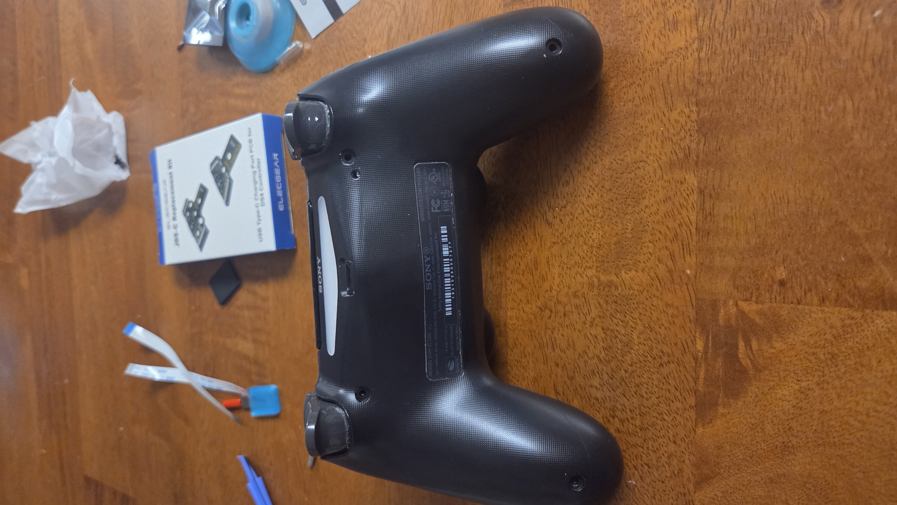
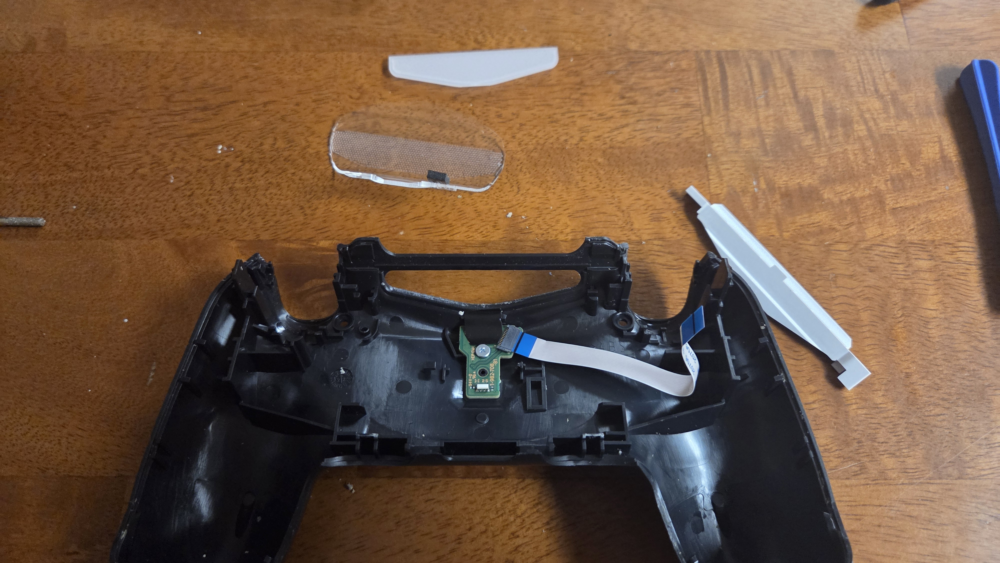
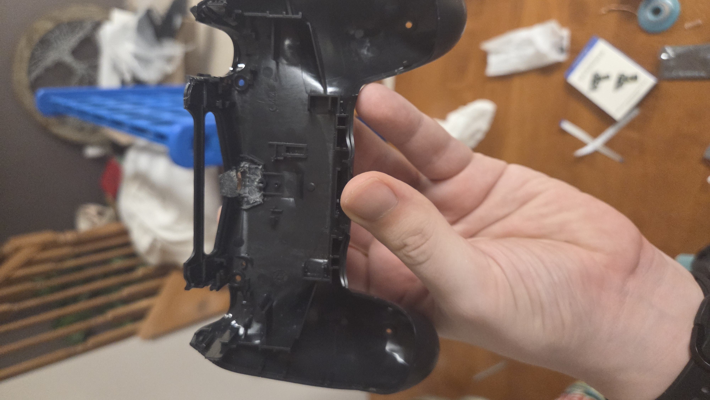

# DS4-Upgrade-Documentation
This is my DS4 upgrade documentation with pics

# Hello!
welcome to my guide on how I upgraded my stock DS4 PS4 Pro 055 model

# READ ME FIRST!
# * Disclaimer
* Keep in mind that the first time you open your DS4 (PS4 Pro DualShock) controller:
  * It WILL be hard to open the first time
  * It WILL be easy to snap and break your vibrators. 
  * You MIGHT accidentally damage your trackpad ribbon cable like I did (replacements are dirt cheap in a good way)
  * You MIGHT break your controller if not done carefully
  * I am not held responsible for any damages YOU do to your device by modding it
  * This is only a rough documentation on what I did to mine so others can be more informed on if they want to take right to repair into their own hands
  * This documentation is as of 1/8/206 is in its rough writing period. 

# #1 Get yout Controller and parts
I bought my parts off Amazon.com, I will link the parts in this documentation
[Ribbon Cables](https://www.amazon.com/dp/B06XGTZVR8?ref=ppx_yo2ov_dt_b_fed_asin_title), [Sticks](https://www.amazon.com/dp/B0D9VWXMZQ?ref=ppx_yo2ov_dt_b_fed_asin_title), [USB-C Mod](https://www.amazon.com/dp/B0DBZL9GFW?ref=ppx_yo2ov_dt_b_fed_asin_title), [Battery](https://www.amazon.com/dp/B0D6VTDDJZ?ref=ppx_yo2ov_dt_b_fed_asin_title)

# #2 Unscrew

# #3 Remove the back plate and cable

# Note
make sure that IF you are replacing the battery to do it during this step since here we can swap the old 1000mAh (1Ah) to teh 4000mAh (4Ah).

# #4 Detach the plates and inner USB Micro port

# #5 Hollow out the space needed for the USB-C port

# #6 Hollow the needed inside space

# #7 Clean it out

# #8 Screw in the new port
make sure you know if its a 45 or 55 by reading the old port.
rebuild it.

# #9 Put it together!

